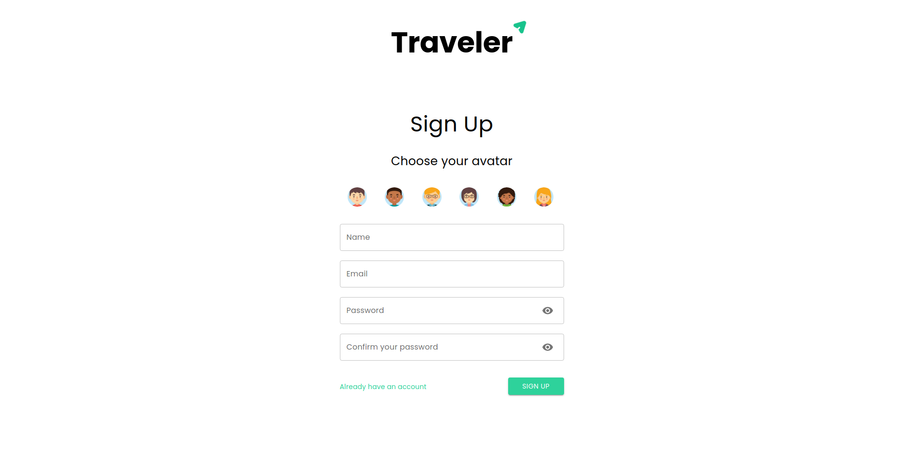
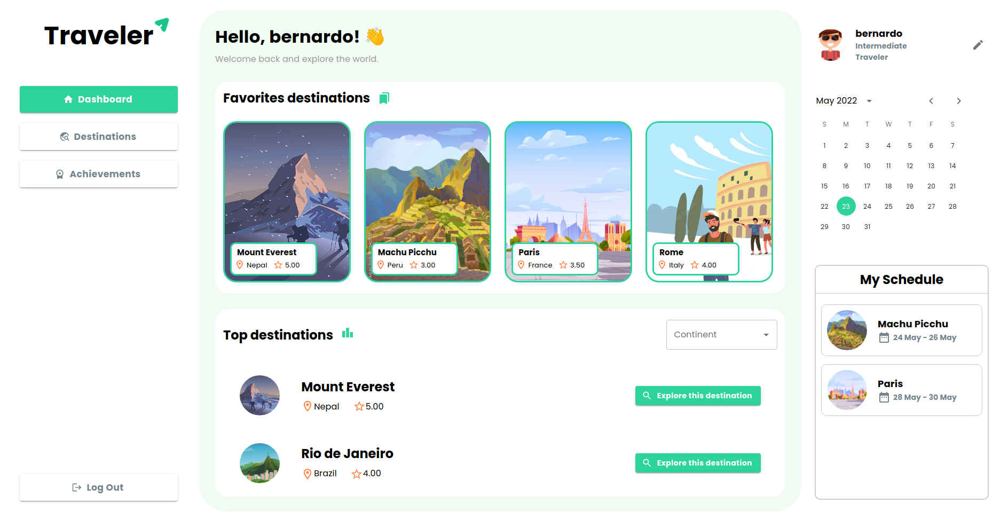
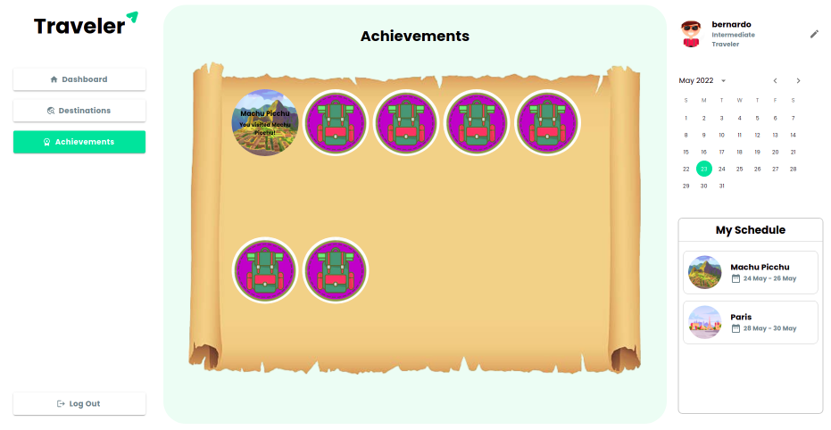

# Traveler

The back-end of a full-stack application with the concept of a travel guide site, where you can create a personal account and explore some of the world's most famous destinations. You can see information about each one and also interact with them by marking as a favorite, booking a trip, earning an achievement when you’ve visited a destination, and rating the destination.

<div align="center">
  
  
  
</div>

<br/>
Try it now at https://traveler.net.br
<br/>
Link to the front-end repository: https://github.com/Bernardo-Rodrigues/traveler-app

## About

The main features of this app are:

- Create a personal account
- View a list of the world’s most famous destinations
- View details about each destination
- Mark a destination as a favorite
- View your list of favorite destinations
- Mark a destination as visited
- Earn achievements for each visited destination
- Rate a destination
- View a ranking of the highest-rated destinations
- Book a trip to a destination
- View your travel schedule
- Receive specific tips when you’re on a trip
- Edit your profile

## Why?

This app was created to put into practice an original idea of a personal travel guide to help with information about the destinations I want to visit. It was also developed to practice creating automated tests with Jest, containerizing the project with Docker, and using CI/CD flows.

## Technologies

The following tools and frameworks were used to build the project:<br>

  
  
  
  
  
  
  
  
  
  
  
  
  
  
  
  
  

## How to run

1. Clone the repository

2. Install Docker
```bash
sudo apt-get install docker-ce docker-ce-cli containerd.io docker-compose-plugin
````

3. Run the container with
```bash
docker-compose up --build
```

4. Finally, access http://localhost:3000 in your favorite browser
